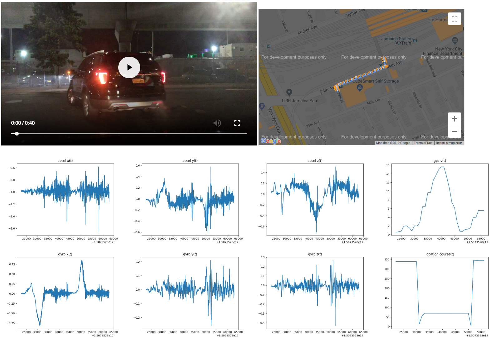

# BDD 100k

BDD100k is a dataset of 100,000 videos taken from dashcams.  FMI see
[the official website](https://bdd-data.berkeley.edu/)

## Setup

### Download ~16GB to ~2TB

You will need to create an account and obtain the dataset ZIP files
from the [official site](https://bdd-data.berkeley.edu/).  The non-video files
total about ~16GB or so; however, the videos zipfile is 1.8TB and can be hard
to obtain.  `au` might operate correctly with partial zip files if you cannot
download all the data.  For the video zipfile, we got the best results
via: 
 1) Using `wget --continue` for a resumable download.
 2) Downloading from either a machine in San Francisco or Google Cloud
      Los Angeles, since the file is hosted in Berkeley.

### Use The `bdd100k.py` Import Tool

Suppose you downloaded the zip files to `/home/aurie/bdd100k`.  Now, drop
into an `au` shell (`aucli --shell`), and then use the provided import tool
to emplace the zip files into the `au` data cache and to run basic setup:
    ```
    /opt/au % au/fixtures/datasets/bdd100k.py --src /outer_root/home/aurie/bdd100k
    ```

## Video Dataset

`au` includes utilities for interoperating with the BDD100k Video Dataset.  In particular, there is a feature
for generating debug webpages to inspect the videos and associated sensor data:




